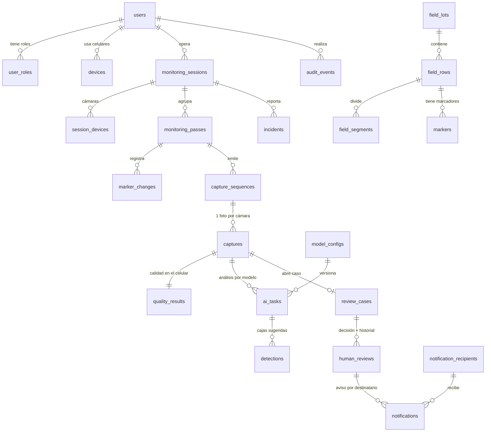

# Arquitectura de datos y seguridad — Supabase + Cloudinary

Versión 1.0 · 05/10/2026 · Se apoya en el Maestro App Móvil v2.0 (§28.4 a §28.12), el Maestro Web v1.0 (Anexo B) y el
capítulo X (Base de datos) y XII (Seguridad) del informe del Curso Integrador II.

> **Resumen.** Las tablas, índices, restricciones y la seguridad de la base **se crean solas** con
> `python manage.py migrate`. No se crean tablas a mano ni se usa Supabase Storage. Lo único manual es la
> configuración del panel de Supabase y de Cloudinary de las secciones 7 y 8: unas pocas casillas, una sola vez por
> entorno.

---

## 1. Qué se guarda en cada lugar

| Dato | Dónde | Quién escribe | Quién lee |
|---|---|---|---|
| Cuentas, celulares, catálogos, sesiones, pasadas, secuencias, capturas (metadatos), IA, casos, decisiones, avisos y auditoría | **Supabase PostgreSQL** (`public`) | Solo Django: API, web y worker | Solo Django |
| Fotos (JPEG originales y derivados) | **Cloudinary**, `type=authenticated`, en `riachuelo/{dev\|piloto}/{sesión}/{pasada}/{captura}` | La app, con un ticket firmado (o el servidor en la compatibilidad v1) | La web, con URLs firmadas; el worker descarga el original |
| Pesos del modelo YOLO (`.onnx`) | Disco del servidor del worker (`ia/inference/weights/`) | El equipo de IA | worker_ia |
| Secretos (`DATABASE_URL`, `CLOUDINARY_URL`, WhatsApp, `DJANGO_SECRET_KEY`) | Variables de entorno o `.env` del servidor | Responsable del backend | Django |
| Datos de campo antes de sincronizar | SQLite local de la app | La app | La app |

La base de datos **no guarda URLs de fotos**: guarda `cloudinary_public_id`, `version`, `bytes`, `format`, `width` y
`height`. Las URLs firmadas se generan al mostrar cada pantalla (W-10).

## 2. Qué se usa de Supabase (Maestro App §28.4)

| Función | ¿Se usa? | Motivo |
|---|---|---|
| PostgreSQL gestionado | **Sí** | Base de datos única del sistema |
| Session pooler (puerto 5432, IPv4) | **Sí** | Así se conectan Django y el worker. El transaction pooler (6543) no se usa porque no admite sentencias preparadas |
| Data API (PostgREST) y GraphQL | **No** | Nadie fuera del servidor lee la base (R-18) |
| Supabase Auth | **No** | El login es de Django (D-28) |
| Supabase Storage | **No** | Las fotos van a Cloudinary (D-26). **No se crean buckets** |
| Realtime | **No** | La web se actualiza con HTMX (bandeja cada 15 s, actividad cada 20 s) |
| Queues (pgmq) | **No** | La cola es la tabla `ai_tasks` (D-29) |

## 3. Modelo de datos (38 tablas: 26 del dominio y 12 técnicas de Django)

Todas las crea `migrate`. Los nombres siguen la Especificación v2.0 §21 (`Meta.db_table`).



| Dominio (app Django) | Tablas | Claves |
|---|---|---|
| Cuentas (`cuentas`) | `users`, `user_roles`, `devices`, `password_reset_requests` | `users.id` UUID; `devices.device_id` = UUID que genera la app al instalarse |
| Catálogos (`campo`) | `field_lots`, `field_rows`, `field_segments`, `markers`, `quality_profiles` | Códigos estables (`SWG1`, `SWG1-H05`) que comparten la app y la web |
| Monitoreo (`monitoreo`) | `monitoring_sessions`, `session_devices`, `monitoring_passes`, `marker_changes`, `capture_sequences`, `incidents` | UUID generados **en la app**: el reenvío es idempotente |
| Evidencia (`evidencias`) | `captures`, `quality_results` | `captures.capture_id` UUID de la app; `cloudinary_public_id` único |
| IA (`ia`) | `model_configs`, `ai_tasks`, `detections` | Un solo modelo activo; una tarea por (foto, modelo) |
| Revisión (`revision`) | `review_cases`, `human_reviews` | Un caso por foto; una sola decisión vigente por caso |
| Avisos (`notificaciones`) | `notification_recipients`, `notification_recipient_lots`, `notifications` | Un aviso por (decisión, destinatario) |
| Auditoría (`auditoria`) | `audit_events` | Solo inserción (§5) |

Las tablas técnicas de Django (`django_session`, `django_migrations`, `django_content_type`, `django_admin_log`,
`auth_*`, `users_groups`, `users_user_permissions`, `token_blacklist_*` y `web_cache`) también tienen RLS y están
cerradas a la Data API.

### Correspondencia con el capítulo X del informe

El informe describe un modelo conceptual de 11 entidades. La implementación v3.0 lo respeta y lo detalla así. Al
actualizar el informe (Maestro App §28.14) conviene usar esta tabla.

| Entidad del informe | Tabla(s) implementadas | Diferencia y motivo |
|---|---|---|
| roles | `user_roles` | Los roles son fijos (Administrador, Especialista, Supervisor, Operador) y una cuenta puede tener varios. Por eso es una tabla puente y no un catálogo editable |
| usuarios | `users` | Agrega estado de cuenta, aprobación, contraseña temporal y aviso de privacidad |
| sesiones (de autenticación) | `django_session` (web), `token_blacklist_*` (app) y `devices` | El JWT no se guarda; solo los refresh revocados y el celular, que se puede revocar |
| sesiones (de monitoreo) | `monitoring_sessions` y `session_devices` | Separadas de la autenticación: un recorrido con 3 celulares |
| lotes | `field_lots`, `field_rows`, `field_segments`, `markers` | El plano de hileras y el mapa necesitan hilera, segmento y marcador |
| pasadas | `monitoring_passes`, `marker_changes` y `capture_sequences` | La pasada es por lateral (A/B); la secuencia agrupa las 2 fotos simultáneas |
| capturas | `captures` y `quality_results` | Incluye la calidad medida en el celular |
| evidencias | Columnas `cloudinary_*` de `captures` | Una foto = un archivo en Cloudinary (relación 1:1), así que no hace falta otra tabla. No se guarda URL |
| ai_tasks | `ai_tasks` y `model_configs` | Es la cola de trabajo con arrendamiento, reintentos y versión del modelo |
| detecciones | `detections` | Cajas en píxeles del original con su confianza, más el resultado de la revisión |
| revisiones | `review_cases` y `human_reviews` | El caso es la unidad de trabajo; la decisión guarda historial y correcciones |
| auditoria | `audit_events` | Solo inserción, con `trace_id` |
| (nuevas) | `incidents`, `notifications`, `notification_recipients`, `password_reset_requests`, `quality_profiles` | Requisitos de la app v2.0 y del aviso por WhatsApp |

Las coordenadas se guardan como `double precision` (unos 15 dígitos), suficiente para los 6 decimales del GPS
(unos 10 cm). Los rangos físicos se aseguran con CHECK (§5).

## 4. Quién escribe qué (flujo)

```
App ──/api/v1──▶ Django API ──INSERT/UPSERT──▶ monitoring_* · capture_sequences · incidents
                     │  (misma transacción)      captures + quality_results + ai_tasks (PENDIENTE)
worker_ia ──SELECT … FOR UPDATE SKIP LOCKED──▶ ai_tasks → detections → review_cases (si hay cajas)
          ──▶ notifications (envío de WhatsApp tras la decisión)
Web (especialista) ──SELECT … FOR UPDATE──▶ review_cases + human_reviews + notifications (una transacción)
Todos ──INSERT──▶ audit_events
```

## 5. Integridad (lo que garantiza la base, no solo el código)

| Mecanismo | Dónde | Para qué |
|---|---|---|
| PK UUID generadas en la app | Sesiones, pasadas, secuencias, capturas e incidencias | Reintentos sin duplicados (upsert idempotente) |
| FK con `PROTECT` | Evidencia, casos y decisiones | No se puede borrar una captura con caso ni un usuario con decisiones |
| UNIQUE | `cloudinary_public_id`, `(review, recipient)`, `(capture, model_config)`, `(pass, sequence_number)`… | Sin fotos, avisos ni análisis duplicados |
| Índices parciales únicos | `model_configs` (un activo) y `human_reviews` (una vigente por caso) | Reglas de negocio garantizadas por la base |
| **CHECK de estados** (44, v1.0+) | Todo campo con estados controlados: `users.status`, `ai_tasks.status`, `review_cases.status`… | Un error de código o una edición desde el panel no pueden dejar un estado inexistente (`config/restricciones.py`) |
| **CHECK de rangos** | `lat` −90..90, `lon` −180..180, `gps_accuracy_m` ≥ 0, confianza 0..1, cajas `x_min < x_max` | Datos físicamente posibles |
| Transacciones | Captura + tarea de IA; decisión + avisos | Nunca «foto sin tarea» ni «confirmado sin aviso» |
| **Auditoría de solo inserción** (trigger, v1.0+) | `audit_events` | UPDATE y DELETE se rechazan, salvo poner `user_id` en NULL si se elimina una cuenta (`auditoria/migrations/0004`) |

## 6. Seguridad en capas

1. **La app nunca tiene credenciales** de Supabase, Cloudinary ni WhatsApp (R-18). Usa JWT con `X-Device-Id`
   contra Django, por HTTPS en piloto.
2. **Django es la única puerta.** Permisos por rol en cada vista, CSRF en la web, límite de intentos de login y
   celulares revocables.
3. **Red.** Conexión cifrada (TLS, `DB_SSLMODE=require`) y, en piloto, conexiones solo desde la IP del servidor
   (§7).
4. **Base de datos.** Después de cada `migrate`, `auditoria/seguridad_bd.py` hace esto:
   - activa **RLS sin políticas** en todas las tablas: los roles `anon` y `authenticated` no ven ninguna fila;
   - **revoca** a `anon` y `authenticated` los permisos sobre tablas, secuencias, funciones y el uso del esquema
     `public`;
   - quita los **privilegios por defecto**, para que una tabla nueva nunca nazca expuesta.

   Django se conecta como dueño de las tablas, a quien RLS no restringe (sin `FORCE`).
5. **Secretos** solo en el servidor (`.env`, nunca en Git). Si una clave se filtra, se rota en el panel y se
   actualiza el `.env`.
6. **Trazabilidad.** `audit_events` de solo inserción y un `traceId` por petición, el mismo en la consola y en la
   respuesta de la API.

> El **Security Advisor** de Supabase mostrará avisos «RLS enabled, no policy» (nivel INFO). Son **intencionales**:
> RLS sin políticas cierra las tablas a la Data API. **No crees políticas.**

## 7. Configuración manual en el panel de Supabase (una vez por proyecto)

| # | Dónde | Qué hacer | Dev | Piloto |
|---|---|---|---|---|
| 1 | Al crear el proyecto | Un proyecto por entorno: `riachuelo-dev` y `riachuelo-piloto`. Región **São Paulo (sa-east-1)** | ✅ | ✅ |
| 2 | Al crear el proyecto | Contraseña de la base larga (24 o más caracteres) **solo con letras y números**, así no rompe la `DATABASE_URL` | ✅ | ✅ |
| 3 | Connect → Direct → **Session pooler** | Copiar la cadena a `DATABASE_URL` y poner `DB_SSLMODE=require` | ✅ | ✅ |
| 4 | Project Settings → **Data API** | Desactivar el Data API o, si no aparece la opción, quitar `public` de *Exposed schemas* | Recomendado | ✅ Obligatorio |
| 5 | Database → Settings → **SSL Configuration** | Activar *Enforce SSL on incoming connections* | ✅ | ✅ |
| 6 | Database → Settings → **Network Restrictions** | Permitir solo la IP del servidor | — (tu IP cambia) | ✅ |
| 7 | Authentication → Sign In / Providers | Desactivar *Allow new users to sign up*; Supabase Auth no se usa | Recomendado | ✅ |
| 8 | Storage y Realtime | **No crear** buckets ni publicaciones | ✅ | ✅ |
| 9 | Table Editor y SQL Editor | **No crear ni editar tablas** desde el panel: solo `python manage.py migrate` | ✅ | ✅ |
| 10 | Plan | Free sirve para dev. **Pro para el piloto**: backups diarios y sin pausa por inactividad (Q-19) | Free | Pro |
| 11 | API Keys | Las claves *anon/publishable* y *service_role* **no se usan en ningún lado**; no las copies a la app | ✅ | ✅ |

Después de configurar: `python manage.py migrate` y `python manage.py diagnostico --red`. El diagnóstico revisa
RLS, permisos, TLS, trigger de auditoría, CHECK y espacio usado.

## 8. Configuración manual en Cloudinary

| # | Dónde | Qué hacer |
|---|---|---|
| 1 | Settings → API Keys | Copiar el *API environment variable* a `CLOUDINARY_URL`, con el secreto real |
| 2 | Transformations → Named | Opcional desde v1.3.1: las URLs firmadas ya llevan `c_limit,w_400,q_auto` (miniatura) y `c_limit,w_1600,q_auto` (revisión) |
| 3 | Settings → Security | Activar **Strict transformations**: nadie puede pedir otros tamaños ni gastar créditos. Las URLs de la plataforma van firmadas y siguen funcionando |
| 4 | Settings → Upload | **No crear** *upload presets* sin firma: toda subida va firmada por Django |
| 5 | Entornos | `CLOUDINARY_ENV_PREFIX=dev` o `piloto`. Lo ideal es una cuenta o *product environment* aparte para el piloto |
| 6 | Uso | Revisar créditos cada semana. Free: 25 al mes, y unas 1 000 fotos consumen unos 10 |

Las fotos son `authenticated`: sin URL firmada no se ven. En el plan Free las URLs firmadas no caducan, por eso el
WhatsApp enlaza al caso en la web (con login) y nunca a la imagen.

## 9. Capacidad, respaldo, mantenimiento y retención

**Capacidad medida** con `docs/perf/datos_sinteticos.sql`: 100 000 fotos con sus análisis y unos 19 000 casos ocupan
**unos 103 MB**, alrededor de 1 KB por foto. El plan Free de Supabase (500 MB) alcanza para unas 300 000 fotos; el
límite real está en los créditos de Cloudinary. `DB_LIMITE_MB` (500 por defecto; 8192 en Pro) hace que el
diagnóstico avise al llegar al 80 %.

| Tarea | Comando | Frecuencia |
|---|---|---|
| Respaldo (pg_dump, formato custom) | `python manage.py respaldo` → `respaldos/riachuelo-<entorno>-<fecha>.dump` | Semanal en Free; en Pro además están los backups diarios de Supabase |
| Restaurar en una base vacía | `pg_restore --no-owner --no-privileges -d "<DATABASE_URL>" archivo.dump` y luego `migrate` | Ante un desastre o para clonar a dev |
| Limpieza técnica | `python manage.py mantenimiento`: sesiones y tokens vencidos y caché vieja. En Free además evita la pausa por inactividad | Semanal |
| Revisión | `python manage.py diagnostico --red` | Tras cada cambio de configuración |

**Retención.** Ni Supabase ni Cloudinary borran evidencia automáticamente. La política de cuánto tiempo guardar
fotos y casos es la pregunta abierta **Q-05** del equipo. Hasta decidirla, no se borra nada (R-11). `mantenimiento`
solo elimina datos técnicos vencidos.

## 10. Entornos

| | Dev (laptop) | Piloto (servidor) |
|---|---|---|
| `APP_ENV` | `dev` | `piloto` (exige HTTPS, Cloudinary, PostgreSQL y prohíbe la demo) |
| Base | SQLite, o el proyecto Supabase `riachuelo-dev` | Proyecto Supabase `riachuelo-piloto` (Pro) |
| Fotos | Simulado local, o Cloudinary con prefijo `dev` | Cloudinary con prefijo `piloto` |
| Datos de demostración | Permitidos (`sembrar_demo`) | **Prohibidos** (W-22): solo `sembrar_demo --solo-catalogos` con los catálogos reales |
| IA | `IA_DETECTOR=simulado` | `IA_DETECTOR=onnx` con el modelo entrenado |

Nunca se mezclan datos de prueba con evidencia del piloto: son proyectos y prefijos distintos.

## 11. Pendientes que dependen del equipo

- [ ] **Modelo YOLO entrenado** (`best.pt` o `.onnx`) con sus clases, `imgsz` y umbrales, para pasar de
      `IA_DETECTOR=simulado` a `onnx` (`ia/inference/weights/LEEME.md`).
- [ ] Catálogos reales: contornos GeoJSON de los lotes y códigos de segmentos y marcadores.
- [ ] WhatsApp Cloud API: token, phone ID y plantilla aprobada.
- [ ] Proyecto Supabase del piloto en plan Pro, con las restricciones de red apuntando a la IP del servidor.
- [ ] Política de retención (Q-05) y servidor con HTTPS en el dominio de Hostinger.
